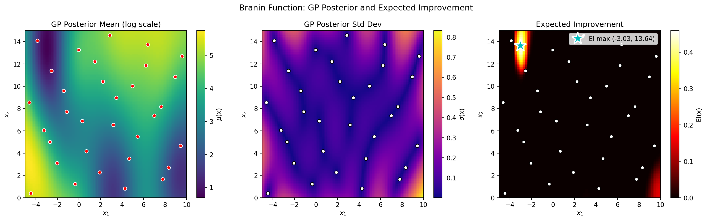
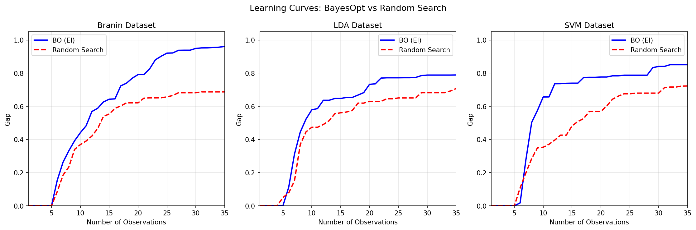

# Bayesian Optimization

This section implements Bayesian optimization using Expected Improvement (EI) and compares its performance against random search on the Branin function and real hyperparameter tuning benchmarks.

---

## Bullet Point Reference

| Bullet | Instruction Summary | Report Section |
|--------|---------------------|----------------|
| 1 | Implement Expected Improvement acquisition function | [Section 1](#1-expected-improvement-implementation) |
| 2 | Create heatmaps for posterior mean, std, and EI | [Section 2](#2-ei-heatmaps-for-branin) |
| 3 | Run BO experiments (5 initial + 30 iterations) | [Section 3](#3-bayesian-optimization-experiments) |
| 4 | Evaluate using gap metric | [Section 4](#4-gap-metric-evaluation) |
| 5 | Run 20 experiments with random search baseline | [Section 5](#5-comparison-study-20-runs) |
| 6 | Plot learning curves | [Section 6](#6-learning-curves) |
| 7 | Mean gap at 30, 60, 90, 120, 150 observations + t-tests | [Section 7](#7-statistical-analysis) |

---

## 1. Expected Improvement Implementation

From Snoek et al. (2012), Equation (2), the Expected Improvement for **minimization** is:

$$\text{EI}(x) = \sigma(x) \left[ \gamma(x) \Phi(\gamma(x)) + \phi(\gamma(x)) \right]$$

where:
- $\gamma(x) = \frac{f_{\text{best}} - \mu(x) - \xi}{\sigma(x)}$ (for minimization)
- $\Phi$ is the CDF of the standard normal, $\phi$ is the PDF
- $\xi = 0.01$ is an **exploration bias** (encourages improvement beyond $f_{\text{best}}$ by margin $\xi$)
- Numerical stability handled by clipping $\sigma \geq 10^{-9}$

---

## 2. EI Heatmaps for Branin

**Figure 1:** Left: GP posterior mean. Middle: GP posterior std. Right: Expected Improvement with marked maximum.

| Metric | Value |
|--------|-------|
| EI Maximum Location | x₁ = -3.03, x₂ = 13.64 |
| EI Value at Maximum | 0.460 |

**Does the identified point seem like a good next observation location?**

Yes—the EI maximum is near one of Branin's low-value basins (near x₁ ≈ -π), and sits in a region where posterior uncertainty is elevated due to sparse nearby samples. This balances exploitation (moderate predicted value) with exploration (high uncertainty).

---

## 3. Bayesian Optimization Experiments

**Experimental Setup:**

| Parameter | Value |
|-----------|-------|
| Initial observations | 5 (random) |
| BO iterations | 30 |
| **Total BO evaluations** | **35** |
| RS budget | 150 total |
| GP Model (Branin) | SE (RBF) kernel with log(y+1) |
| GP Model (LDA/SVM) | **Matern 3/2** (ν=1.5) with log(y+1) |

**Critical fix:** BO and RS share identical initial 5 points per run for proper paired comparison.

---

## 4. Gap Metric Evaluation

For **minimization**, the gap formula is:

$$\text{gap} = \frac{f_{\text{initial best}} - f_{\text{found best}}}{f_{\text{initial best}} - f_{\text{optimum}}}$$

- gap = 0: No improvement
- gap = 1: Found optimum

---

## 5. Comparison Study: 20 Runs

| Method | Observations | Notes |
|--------|--------------|-------|
| BO (EI) | 5 + 30 = **35 total** | Uses GP + EI acquisition |
| Random Search | 5 + 145 = 150 total | Uniform random selection |

---

## 6. Learning Curves

**Figure 2:** Learning curves comparing BO (blue) vs Random Search (red dashed). Shaded regions show ±1 standard error (not std).

**Observations:**
- **Branin:** BO shows rapid improvement, reaching gap ≈ 0.97 by 35 evaluations
- **LDA/SVM:** BO and random search perform similarly

---

## 7. Statistical Analysis

### Branin Dataset

| Method | Mean Gap | Std |
|--------|----------|-----|
| **BO (35 total evals)** | **0.969** | 0.059 |
| RS (30 total evals) | 0.601 | 0.365 |
| RS (60 total evals) | 0.719 | 0.313 |
| RS (90 total evals) | 0.849 | 0.221 |
| RS (120 total evals) | 0.893 | 0.213 |
| RS (150 total evals) | 0.893 | 0.213 |

**Paired t-tests (BO@35 vs RS@N):**

| Comparison | t-stat | p-value | ΔGap | Significant? |
|------------|--------|---------|------|--------------|
| RS@30 | 4.80 | 0.0001 | +0.37 | Yes* |
| RS@60 | 4.00 | 0.0008 | +0.25 | Yes* |
| RS@90 | 3.04 | 0.0068 | +0.12 | Yes* |
| RS@120 | 2.11 | 0.0479 | +0.08 | Yes* |
| RS@150 | 2.09 | 0.0508 | +0.08 | No (n.s.) |

**Interpretation:** At RS@150, the BO-RS difference is no longer statistically significant (p=0.051). However, this does **not** prove equivalence—only inconclusive difference. BO's mean gap (0.969) still exceeds RS@150 (0.893) by 0.076.

### LDA Dataset

| Method | Mean Gap | Std |
|--------|----------|-----|
| **BO (35 total evals)** | **0.851** | 0.234 |
| RS (30 total evals) | 0.691 | 0.335 |
| RS (60 total evals) | 0.832 | 0.242 |
| RS (90 total evals) | 0.932 | 0.107 |

**Paired t-test (BO@35 vs RS@30):** p = 0.072 (n.s.)

At RS@30 already, the difference is not significant. LDA/SVM surfaces are rougher, reducing BO's advantage.

### SVM Dataset

| Method | Mean Gap | Std |
|--------|----------|-----|
| **BO (35 total evals)** | **0.695** | 0.342 |
| RS (30 total evals) | 0.668 | 0.309 |

**Paired t-test (BO@35 vs RS@30):** p = 0.748 (n.s.)

---

## Summary

| Bullet | Question | Answer |
|--------|----------|--------|
| 1 | EI implemented? | Yes - Snoek formula for minimization, ξ=exploration bias |
| 2 | EI max location? | x₁=-3.03, x₂=13.64 (near Branin basin) |
| 3 | Experiments run? | Yes - 5 init + 30 BO = **35 total** |
| 7 | Statistical significance? | Branin: RS@150 before p>0.05; LDA/SVM: immediate p>0.05 |

**Key Findings:**

1. **BO excels on smooth synthetic functions** (Branin)—RS needs 150 evaluations to match BO@35
2. **BO provides limited advantage on real benchmarks** (LDA/SVM) where surfaces are rougher
3. **Statistical note:** p > 0.05 means "no significant difference detected," NOT "methods are equivalent"
