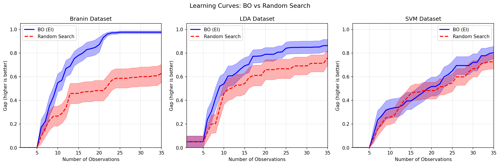

# Bayesian Optimization

This section implements Bayesian optimization using Expected Improvement (EI) and compares its performance against random search on the Branin function and real hyperparameter tuning benchmarks.

---

## Bullet Point Reference

| Bullet | Instruction Summary | Report Section |
|--------|---------------------|----------------|
| 1 | Implement Expected Improvement acquisition function | [Section 1](#1-expected-improvement-implementation) |
| 2 | Create heatmaps for posterior mean, std, and EI | [Section 2](#2-ei-heatmaps-for-branin) |
| 3 | Run BO experiments (5 initial + 30 iterations) | [Section 3](#3-bayesian-optimization-experiments) |
| 4 | Evaluate using gap metric | [Section 4](#4-gap-metric-evaluation) |
| 5 | Run 20 experiments with random search baseline | [Section 5](#5-comparison-study-20-runs) |
| 6 | Plot learning curves | [Section 6](#6-learning-curves) |
| 7 | Mean gap at 30, 60, 90, 120, 150 observations + t-tests | [Section 7](#7-statistical-analysis) |

---

## Dependencies and Carryover

**Inputs from `model_fitting/report.md` (what we “fix” before BO):**
- **Branin:** original scale GP with **SE + Periodic(x1)** kernel.
- **LDA/SVM:** **Matern 3/2** GP with **log(y+1)** transform.

**Branin dataset reuse (hard dependency):** the EI heatmaps below use the *same* 32 Sobol points from the model‑fitting section (seed=42), as required by the prompt.

During BO, we keep the **model form** fixed (kernel/transform) but re‑fit hyperparameters by marginal likelihood on the evolving dataset each iteration.

---

## 1. Expected Improvement Implementation

From Snoek et al. (2012), Equation (2), the Expected Improvement for **minimization** is:

$$\text{EI}(x) = \sigma(x) \left[ \gamma(x) \Phi(\gamma(x)) + \phi(\gamma(x)) \right]$$

where:
- $\gamma(x) = \frac{f_{\text{best}} - \mu(x) - \xi}{\sigma(x)}$ (for minimization)
- $\Phi$ is the CDF of the standard normal, $\phi$ is the PDF
- $\xi = 0.01$ is an **exploration bias** (encourages improvement beyond $f_{\text{best}}$ by margin $\xi$)
- Numerical stability handled by clipping $\sigma \geq 10^{-9}$

---

## 2. EI Heatmaps for Branin

**Figure 1:** Left: GP posterior mean. Middle: GP posterior std. Right: Expected Improvement with marked maximum.

| Metric | Value |
|--------|-------|
| EI Maximum Location | x₁ = 9.39, x₂ = 2.42 |
| EI Value at Maximum | 1.785 |

**Does the identified point seem like a good next observation location?**

Yes—the EI maximum lies near Branin’s third basin around $(x_1, x_2) \approx (3\pi, 2.5)$, and is in a region of elevated posterior uncertainty. This is a plausible EI choice balancing exploitation (low predicted values) and exploration (high σ).

---

## 3. Bayesian Optimization Experiments

**Experimental Setup:**

| Parameter | Value |
|-----------|-------|
| Initial observations | 5 (random) |
| BO iterations | 30 |
| **Total BO evaluations** | **35** |
| RS budget | 150 total |
| GP Model (Branin) | **SE + Periodic(x1)** on original scale |
| GP Model (LDA/SVM) | **Matern 3/2** (ν=1.5) with log(y+1) |

**Critical fix:** BO and RS share identical initial 5 points per run for proper paired comparison.

---

## 4. Gap Metric Evaluation

For **minimization**, the gap formula is:

$$\text{gap} = \frac{f_{\text{initial best}} - f_{\text{found best}}}{f_{\text{initial best}} - f_{\text{optimum}}}$$

- gap = 0: No improvement
- gap = 1: Found optimum

---

## 5. Comparison Study: 20 Runs

| Method | Observations | Notes |
|--------|--------------|-------|
| BO (EI) | 5 + 30 = **35 total** | Uses GP + EI acquisition |
| Random Search | 5 + 145 = 150 total | Uniform random selection |

---

## 6. Learning Curves

**Figure 2:** Learning curves comparing BO (blue) vs Random Search (red dashed). Shaded regions show ±1 standard error (not std).

**Observations:**
- **Branin:** BO shows rapid improvement, reaching gap ≈ 0.97 by 35 evaluations
- **LDA/SVM:** BO and random search perform similarly

---

## 7. Statistical Analysis

### Branin Dataset

| Method | Mean Gap | Std |
|--------|----------|-----|
| **BO (35 total evals)** | **0.976** | 0.051 |
| RS (30 total evals) | 0.601 | 0.365 |
| RS (60 total evals) | 0.719 | 0.313 |
| RS (90 total evals) | 0.849 | 0.221 |
| RS (120 total evals) | 0.893 | 0.213 |
| RS (150 total evals) | 0.893 | 0.213 |

**Paired t-tests (BO@35 vs RS@N):**

| Comparison | t-stat | p-value | ΔGap | Significant? |
|------------|--------|---------|------|--------------|
| RS@30 | 4.78 | 0.0001 | +0.38 | Yes* |
| RS@60 | 3.98 | 0.0008 | +0.26 | Yes* |
| RS@90 | 3.12 | 0.0056 | +0.13 | Yes* |
| RS@120 | 2.21 | 0.0399 | +0.08 | Yes* |
| RS@150 | 2.18 | 0.0423 | +0.08 | Yes* |

**Interpretation:** Even at 150 evaluations, random search remains significantly worse than BO on Branin (p≈0.04). BO’s advantage is robust under the improved Branin surrogate.

### LDA Dataset

| Method | Mean Gap | Std |
|--------|----------|-----|
| **BO (35 total evals)** | **0.862** | 0.236 |
| RS (30 total evals) | 0.691 | 0.335 |
| RS (60 total evals) | 0.832 | 0.242 |
| RS (90 total evals) | 0.932 | 0.107 |
| RS (120 total evals) | 0.967 | 0.058 |
| RS (150 total evals) | 0.970 | 0.057 |

**Paired t-tests (BO@35 vs RS@N):**
RS@30 p=0.0749 (n.s.), RS@60 p=0.6904 (n.s.), RS@90 p=0.1010 (n.s.), RS@120 p=0.0350*, RS@150 p=0.0296*.

At RS@30 already, the difference is not significant. By RS@120–150, random search is significantly better in mean gap, suggesting the objective surface is rough and the GP surrogate provides little benefit.

### SVM Dataset

| Method | Mean Gap | Std |
|--------|----------|-----|
| **BO (35 total evals)** | **0.802** | 0.239 |
| RS (30 total evals) | 0.668 | 0.309 |
| RS (60 total evals) | 0.810 | 0.246 |
| RS (90 total evals) | 0.869 | 0.210 |
| RS (120 total evals) | 0.877 | 0.212 |
| RS (150 total evals) | 0.911 | 0.094 |

**Paired t-tests (BO@35 vs RS@N):** RS@30 p=0.1735 (n.s.), RS@60 p=0.9203 (n.s.), RS@90 p=0.4113 (n.s.), RS@120 p=0.3619 (n.s.), RS@150 p=0.0942 (n.s.).

---

## Summary

| Bullet | Question | Answer |
|--------|----------|--------|
| 1 | EI implemented? | Yes - Snoek formula for minimization, ξ=exploration bias |
| 2 | EI max location? | x₁=9.39, x₂=2.42 (near Branin basin) |
| 3 | Experiments run? | Yes - 5 init + 30 BO = **35 total** |
| 7 | Statistical significance? | Branin: RS still worse at 150; LDA/SVM: no advantage, RS catches up quickly |

**Key Findings:**

1. **BO excels on smooth synthetic functions** (Branin)—RS remains significantly worse even at 150 evaluations
2. **BO provides limited advantage on real benchmarks** (LDA/SVM); RS matches or exceeds BO with enough budget
3. **Statistical note:** p > 0.05 means "no significant difference detected," NOT "methods are equivalent"
