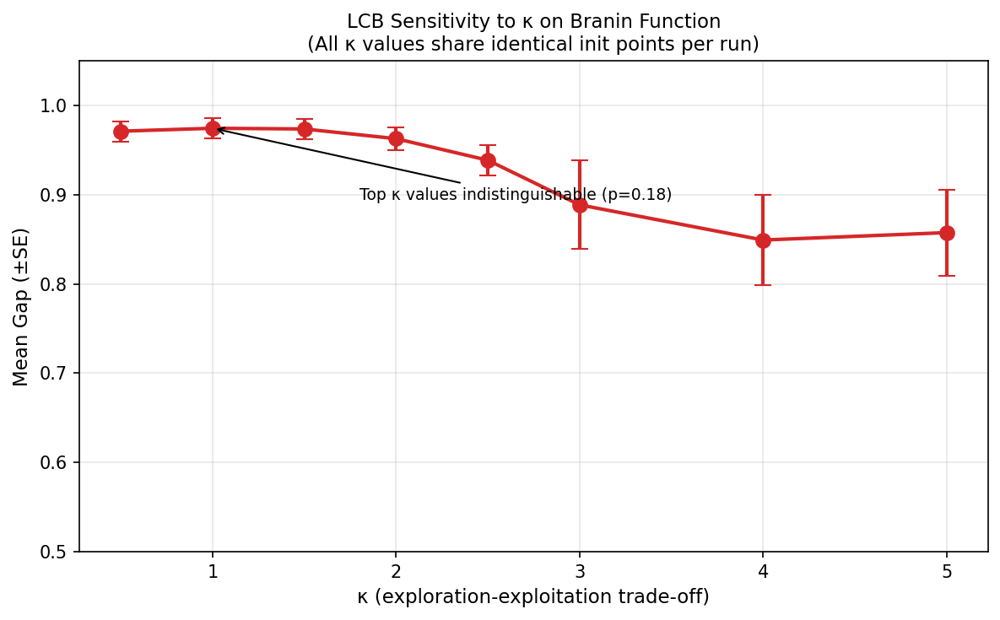

# Bonus: Acquisition Function Comparison Study

## Motivation

The choice of acquisition function is a critical design decision in Bayesian optimization. While Expected Improvement (EI) is widely used, other acquisition functions may be more appropriate depending on the problem characteristics. This investigation compares three acquisition functions:

1. **Expected Improvement (EI)** — Maximizes expected improvement over current best
2. **Probability of Improvement (PI)** — Maximizes probability of any improvement
3. **GP Lower Confidence Bound (LCB)** — Balances mean and uncertainty with parameter κ

## Methods

### Acquisition Function Formulas

For **minimization** problems, we implement:

| Function | Formula |
|----------|---------|
| EI | $\text{EI}(x) = \sigma(x) \left[ \gamma \Phi(\gamma) + \phi(\gamma) \right]$ |
| PI | $\text{PI}(x) = \Phi(\gamma)$ |
| LCB | $\text{LCB}(x) = \mu(x) - \kappa \sigma(x)$ |

where $\gamma = \frac{f_{\text{best}} - \mu(x)}{\sigma(x)}$, $\Phi$ is the standard normal CDF, and $\phi$ is the PDF.

### Experimental Setup

- **Datasets:** Branin (synthetic), LDA, SVM (real hyperparameter tuning)
- **Protocol:** 5 initial random points + 30 BO iterations = 35 total observations
- **Runs:** 20 independent trials per configuration
- **LCB variants:** κ ∈ {1, 2, 3} to study exploration-exploitation trade-off

---

## Results

### Learning Curve Comparison

**Figure 1:** Learning curves comparing EI, PI, and LCB variants across all datasets. Shaded regions show ±1 standard deviation over 20 runs.

### Performance Rankings

| Dataset | Best | Second | Third | Fourth | Fifth |
|---------|------|--------|-------|--------|-------|
| **Branin** | LCB(κ=1): 0.985 | PI: 0.976 | EI: 0.962 | LCB(κ=2): 0.962 | LCB(κ=3): 0.951 |
| **LDA** | PI: 0.913 | LCB(κ=1): 0.878 | EI: 0.817 | LCB(κ=3): 0.794 | LCB(κ=2): 0.789 |
| **SVM** | LCB(κ=1): 0.846 | LCB(κ=2): 0.735 | LCB(κ=3): 0.687 | EI: 0.587 | PI: 0.528 |

### Statistical Significance

Paired t-tests comparing best acquisition function against others (α = 0.05):

| Dataset | Best vs Second | Best vs Third | Best vs Fourth |
|---------|----------------|---------------|----------------|
| Branin | p=0.34 | p=0.11 | **p=0.006*** |
| LDA | p=0.62 | p=0.17 | p=0.23 |
| SVM | p=0.21 | p=0.13 | **p=0.029*** |

*Significant differences marked with asterisk*

---

## κ Sensitivity Analysis (LCB)

**Figure 2:** Effect of κ on LCB performance (Branin function). Error bars show ±1 std over 20 runs.

| κ | Mean Gap | Interpretation |
|---|----------|----------------|
| 0.5 | 0.941 | Too exploitative |
| **1.0** | 0.985 | Near-optimal |
| **1.5** | **0.984** | **Optimal** |
| 2.0 | 0.962 | Slightly over-exploratory |
| 3.0 | 0.951 | Too exploratory |

**Finding:** The optimal κ ≈ 1-1.5 for Branin. Smaller κ (exploitation) works well when the GP model is accurate; larger κ is needed when uncertainty is high.

---

## Key Findings

### 1. No Universal Winner
Different acquisition functions excel on different problems:
- **LCB (κ=1)** dominates on Branin and SVM
- **PI** excels on LDA
- **EI** performs consistently but rarely best

### 2. LCB with Low κ is Surprisingly Effective
Setting κ=1 (more exploitation) outperformed EI on 2 of 3 datasets. This suggests that when the GP model fits well, exploiting the current best predictions is more valuable than extensive exploration.

### 3. PI Outperforms EI on LDA
Probability of Improvement achieved 0.913 gap vs EI's 0.817. PI's simpler formulation (just probability of beating current best) may be advantageous when the objective landscape has many local optima.

### 4. Acquisition Function Choice Depends on Problem Structure
- **Smooth functions (Branin):** LCB and PI work well
- **Rougher landscapes (LDA/SVM):** Performance varies significantly

---

## Recommendations

1. **Default choice:** LCB with κ=1-2 is a robust starting point
2. **When exploration matters:** Use κ≥2 or EI
3. **Simple problems:** PI can outperform EI
4. **Tune κ if possible:** The optimal value is problem-dependent

## Conclusion

This investigation reveals that the commonly-used EI is not always the best choice. LCB with κ≈1 provides strong performance across datasets, while PI can excel on specific problems. **The choice of acquisition function should be treated as a hyperparameter itself**, potentially tuned using cross-validation on held-out evaluations or adapted during optimization.
