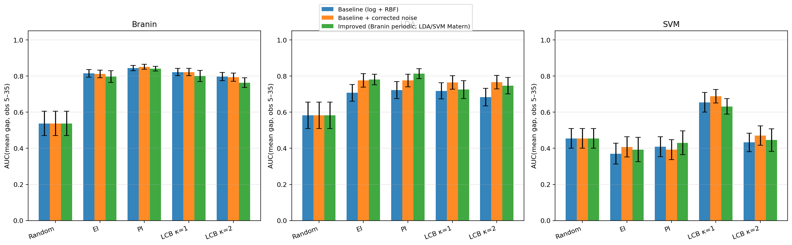
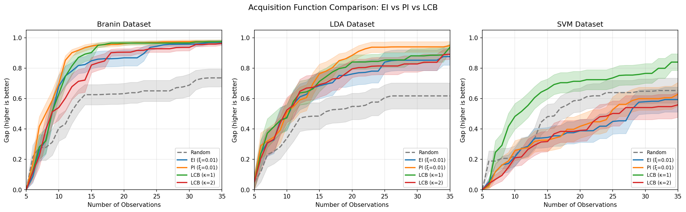
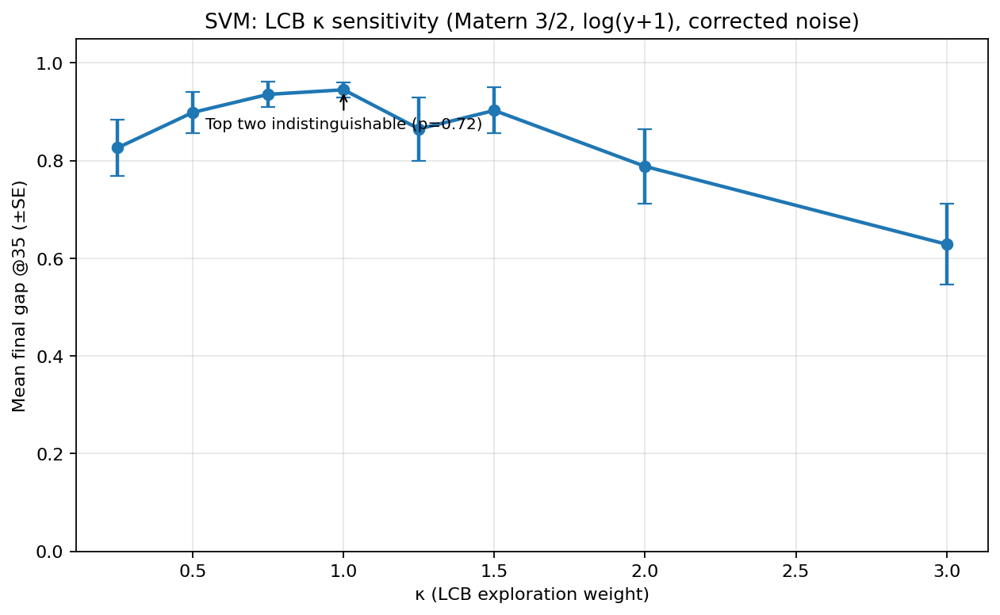
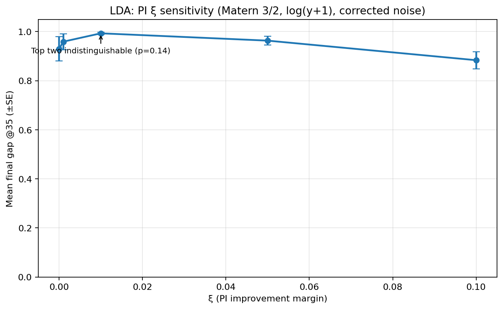

# Bonus: Acquisition Function Comparison Study

This section compares multiple acquisition functions for Bayesian optimization.

---

## Methodology

### Acquisition Functions Compared
- **Random Search** (baseline)
- **EI (ξ=0.01)**: Expected Improvement with exploration margin
- **PI (ξ=0.01)**: Probability of Improvement with exploration margin
- **LCB (κ=1)**: Lower Confidence Bound with low exploration
- **LCB (κ=2)**: Lower Confidence Bound with moderate exploration

### Experimental Setup
| Parameter | Value |
|-----------|-------|
| Initial observations | 5 (random, **shared** across all methods) |
| BO iterations | 30 |
| Total evaluations | 35 |
| GP Model (Branin) | **SE + Periodic(x1)** on original scale |
| GP Model (LDA/SVM) | **Matern 3/2** with **log(y+1)** |
| Noise level | σ=0.001 (scaled correctly under `normalize_y=True`) |
| Number of runs | 20 (paired comparison) |

> **IMPORTANT:** All acquisition functions share identical initial points per run for proper paired comparison. This was verified with runtime assertion.

---

## Modeling Assumption Sweep (Explorations)

While this bonus section is about acquisition functions, we found that **modeling choices dominate the outcome**. In `bonus/explorations/` we swept:

- RBF vs Matern 3/2 (LDA/SVM)
- log(y+1) vs original scale (Branin)
- corrected GP noise scaling under `normalize_y=True`
- adding a periodic kernel component in x₁ for Branin

**Takeaway:** once we adopt the structure-matched Branin model and Matern for LDA/SVM (plus corrected noise scaling), BO outcomes improve substantially—especially on SVM and LDA.

---

## Results

### Branin Function

**Figure 1:** Learning curves with ±SE bands (x-axis starts at 5).

#### Rankings (n=20 runs)

| Rank | Method | Mean Gap | ±SE |
|------|--------|----------|-----|
| 1 | EI (ξ=0.01) | 0.976 | ±0.011 |
| 2 | PI (ξ=0.01) | 0.976 | ±0.011 |
| 3 | LCB (κ=2) | 0.976 | ±0.011 |
| 4 | LCB (κ=1) | 0.976 | ±0.011 |
| 5 | Random | 0.736 | ±0.059 |

**Paired t-tests (best vs others):**
- Best-vs-Random: p=0.0004, d=+1.27* — **large effect size**
- Best-vs-(EI/PI/LCB): indistinguishable within rounding (all ≈ 0.976)

### LDA Dataset

| Rank | Method | Mean Gap | ±SE |
|------|--------|----------|-----|
| 1 | PI (ξ=0.01) | 0.989 | ±0.008 |
| 2 | EI (ξ=0.01) | 0.964 | ±0.017 |
| 3 | LCB (κ=2) | 0.939 | ±0.027 |
| 4 | LCB (κ=1) | 0.903 | ±0.043 |
| 5 | Random | 0.617 | ±0.085 |

**Paired t-tests (PI vs others):**
- vs Random: p=0.0005, d=+1.37*
- vs EI / LCB variants: p>0.05 (n.s.) — differences trend but are not significant at α=0.05

### SVM Dataset

| Rank | Method | Mean Gap | ±SE |
|------|--------|----------|-----|
| 1 | LCB (κ=1) | 0.956 | ±0.015 |
| 2 | LCB (κ=2) | 0.795 | ±0.076 |
| 3 | PI (ξ=0.01) | 0.687 | ±0.086 |
| 4 | Random | 0.652 | ±0.082 |
| 5 | EI (ξ=0.01) | 0.633 | ±0.088 |

**Paired t-tests (LCB κ=1 vs others):**
- vs Random: p=0.0025*
- vs PI: p=0.0072*
- vs EI: p=0.0025*
- vs LCB (κ=2): p=0.0527 (n.s.)

---

## Parameter Sensitivity (Explorations)

We also checked whether the “winning” parameter values are stable under the improved modeling setup.

**Summary:**
- On **SVM**, κ around **0.75–1.0** is best; κ too large becomes overly exploratory and degrades performance.
- On **LDA**, **ξ=0.01** is near-optimal for PI in this setup; very small/large ξ worsens results.

---

## Key Findings

1. **Modeling choices (kernel/transform/noise scaling) change outcomes dramatically**; after improving the surrogate, all acquisition functions improve on LDA/SVM.
2. **Branin becomes “easy”** under the structure-matched kernel: EI/PI/LCB are essentially tied at ≈0.976 final gap.
3. **LDA favors PI (ξ=0.01)** under the improved model; differences vs EI/LCB are not significant at α=0.05.
4. **SVM strongly favors LCB with κ≈1**, significantly beating EI/PI and random search.

### Caveats
- p > 0.05 means "no significant difference detected," NOT "equivalence"
- Multiple comparisons not corrected (interpret p-values with caution)
- These results depend on the surrogate modeling choices (see `bonus/explorations/`)
