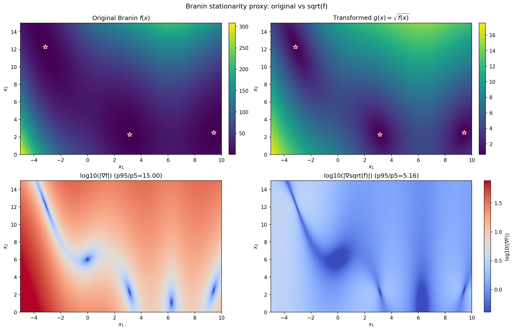
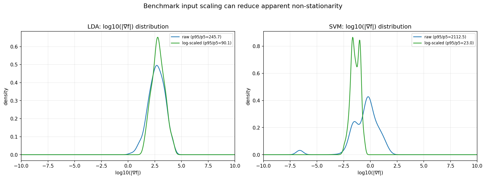

# Data Visualization

This section presents our initial exploration of the objective functions used in this Bayesian optimization investigation: the synthetic Branin benchmark and the real-world hyperparameter tuning datasets for SVM and LDA models.

---

## Bullet Point Reference

This report addresses each bullet point from the [instructions](instructions.md):

| Bullet | Instruction Summary | Report Section |
|--------|---------------------|----------------|
| 1 | Make a 1000×1000 heatmap of Branin function | [Section 1](#1-branin-function-heatmap) |
| 2 | Describe behavior and stationarity | [Section 2](#2-stationarity-analysis) |
| 3 | Find transformation for stationarity | [Section 3](#3-transformation-for-improved-stationarity) |
| 4 | KDE of LDA and SVM distributions, interpret | [Section 4](#4-kernel-density-estimates-for-lda-and-svm-benchmarks) |
| 5 | Find transformation for better-behaved distributions | [Section 5](#5-transformation-for-better-behaved-distributions) |

---

## 1. Branin Function Heatmap

> **Bullet 1:** *"Make a heatmap of the value of the Branin function over the domain X = [−5, 10] × [0, 15] using a dense grid of values, with 1000 values per dimension, forming a 1000 × 1000 image."*

We evaluated the Branin function over the domain $\mathcal{X} = [-5, 10] \times [0, 15]$ using a dense 1000 × 1000 grid (1,000,000 evaluation points).

**Figure 1:** Heatmap of the Branin function. Red stars mark the three global minima at $(-\pi, 12.275)$, $(\pi, 2.275)$, and $(9.42478, 2.475)$, each with value $f^* \approx 0.398$.

The Branin function is defined as:

$$f(x_1, x_2) = a\left(x_2 - bx_1^2 + cx_1 - r\right)^2 + s(1-t)\cos(x_1) + s$$

with standard parameters $a=1$, $b=\frac{5.1}{4\pi^2}$, $c=\frac{5}{\pi}$, $r=6$, $s=10$, $t=\frac{1}{8\pi}$.

**Key observations:**
- Function values range from approximately 0.4 (at minima) to over 300 (at corners)
- Three distinct global minima create multiple attraction basins
- The parabolic valley structure is modulated by the cosine term

---

## 2. Stationarity Analysis

> **Bullet 2:** *"Describe the behavior of the function. Does it appear stationary? (That is, does the behavior of the function appear to be relatively constant throughout the domain?)"*

**Note on terminology:** In GP theory, "stationarity" refers to a kernel property (covariance depends only on displacement), not an intrinsic function property. A deterministic function doesn't have "stationarity" as such—what we're really asking is: **Will a stationary GP with a single global lengthscale fit well?**

**Answer: A stationary GP with a single lengthscale will struggle** because the function exhibits regions of very different curvature and amplitude across the domain.

### Evidence for Model Mismatch

1. **Non-constant amplitude:** Values range from 0.4 to 308—a stationary GP with one output scale cannot capture this variation.

2. **Varying curvature:** Sharp curvature near minima, flatter behavior in high-value regions. A single lengthscale cannot capture both.

3. **Asymmetric structure:** The three global minima create valleys of varying depths and widths.

4. **Anisotropic behavior:** The cosine term adds oscillation only in $x_1$ (period ~2π ≈ 6.3), suggesting different lengthscales are needed for each dimension.

### Quantitative Support: Gradient Magnitude (proxy)

A practical proxy for “how non-stationary this looks” is how uneven the gradient magnitude $|\nabla f(x)|$ is over the domain. If the gradient varies wildly, a stationary GP with a single global lengthscale will struggle.

In Section 3 we compare the original Branin to a simple monotone transform and report a robust gradient-variation metric (p95/p5 of $|\nabla f|$).

**Implications for Bayesian Optimization:**
- Use ARD (Automatic Relevance Determination) kernels with per-dimension lengthscales
- Consider transformations (e.g., log) to compress amplitude variation
- A stationary SE/Matérn kernel may require many training points in high-curvature regions

---

## 3. Transformation for Improved Stationarity

> **Bullet 3:** *"Can you find a transformation of the data that makes it more stationary?"*

**Yes.** A simple variance‑compressing transform that improves Branin’s apparent stationarity is:

$$g(x_1, x_2) = \sqrt{f(x_1, x_2)}$$

**Figure 2:** Original vs `sqrt(f)` transformed Branin (top row) and corresponding gradient-magnitude maps (bottom row; log scale). The p95/p5 ratio in the titles summarizes gradient variation (lower is better).

**Key quantitative change:**
- Original: p95/p5($|\nabla f|$) ≈ 15.00  
- `sqrt(f)`: p95/p5($|\nabla \sqrt{f}|$) ≈ 5.16  

**Why does this help?**
- Compresses the dynamic range while keeping minima locations unchanged (monotone transform)
- Reduces variation in local curvature, making a single global lengthscale less implausible

---

## 4. Kernel Density Estimates for LDA and SVM Benchmarks

> **Bullet 4:** *"Make a kernel density estimate of the distribution of the values for the LDA and SVM benchmarks. Interpret the distributions."*

We analyze the distribution of objective values for the hyperparameter tuning benchmarks:
- **LDA:** 288 hyperparameter configurations
- **SVM:** 1,400 hyperparameter configurations

**Figure 3:** KDEs for LDA and SVM benchmarks (left column: original; right column: log-transformed). KDEs use SciPy's default bandwidth selection (Scott's rule); shapes should be interpreted qualitatively.

### LDA Benchmark
| Statistic | Value |
|-----------|-------|
| Samples | 288 |
| Range | [1266.17, 5258.11] |
| Mean | 1820.67 |
| Std. Dev. | 722.33 |
| Skewness | 2.37 (right-skewed) |

**Interpretation:** Right-skewed distribution with a long tail toward poor performance. Most configurations cluster around moderate values (1300–2000), while some produce very poor results (>3000). Optimal configurations are relatively rare.

### SVM Benchmark
| Statistic | Value |
|-----------|-------|
| Samples | 1,400 |
| Range | [0.2411, 0.5000] |
| Mean | 0.3136 |
| Std. Dev. | 0.0693 |
| Skewness | 1.30 (right-skewed) |

**Interpretation:** The error rate clusters around 0.27–0.35, with outliers at 0.5 (random chance). The minimum (~0.24) represents near-optimal classification accuracy.

> **Methodological note:** SVM error is a **bounded metric** (error rate ∈ [0, 0.5]). Gaussian KDEs can leak density outside the feasible range. For bounded metrics, consider boundary-corrected KDEs or transforms like logit.

**Common Pattern:** Both distributions are right-skewed—common in hyperparameter landscapes where there are many ways to configure poorly but few optimal configurations.

---

## 5. Transformation for Better-Behaved Distributions

> **Bullet 5:** *"Again, can you find a transformation that makes the performance better behaved?"*

**Yes.** We apply a log transformation to both benchmark distributions:

$$y' = \log(y)$$

### Skewness Reduction

| Benchmark | Original Skewness | Log-Transformed | Reduction |
|-----------|-------------------|-----------------|-----------|
| LDA | 2.368 | 1.353 | **42.9%** |
| SVM | 1.302 | 1.078 | **17.2%** |

### What Log Transforms Actually Help With

> **Important clarification:** GP regression assumes Gaussian noise at each input point, NOT that the marginal distribution of y-values across different x's must be Gaussian. Reducing skewness is NOT directly about satisfying GP likelihood assumptions.

**Proper reasons for log transformation:**

1. **Variance compression:** Reduces heteroscedastic-looking behavior; multiplicative effects become additive.

2. **Reduced leverage of extremes:** Extreme high values have less influence on GP hyperparameter fitting.

3. **Stationary GP compatibility:** Stationary kernel fit becomes "less dominated" by big-amplitude regions.

**For bounded metrics (like SVM error):**
- Log is one reasonable choice, but not ideal for bounded data
- Better alternatives: **logit** transform (after rescaling to (0,1)), **arcsin-sqrt** (classic variance stabilizer for proportions), or **Box-Cox / Yeo-Johnson** (learn the power transform)

**Hypothesis to test:** Log transforms are a reasonable candidate for improving GP fit quality. We will compare marginal likelihood and calibration with and without transforms in the model-fitting section to validate this empirically.

### Input scaling matters for “stationarity” on LDA/SVM

The benchmark hyperparameter grids span orders of magnitude in some dimensions (especially SVM). Even with the same objective, modeling in raw units vs log-scaled units can change how stationary the surface appears.

**Figure 4:** Distribution of log10($|\nabla f|$) under raw vs log-scaled input coordinates. The p95/p5 ratio summarizes gradient variation (lower is better).

Key result (p95/p5 of $|\nabla f|$):
- LDA: 245.75 → 90.10 (log10 scaling dims 2&3)
- SVM: 2112.50 → 22.98 (log10 scaling dims 1&3)

**Takeaway:** For LDA/SVM, log-scaling positive hyperparameters is often as important as output transforms for making a stationary GP surrogate plausible.

Additional deeper sweeps (including Box-Cox output transforms) are in `data_visualization/explorations/exploratory_results.md`.

---

## Carryover to Model Fitting

This section motivates (but does not yet validate) modeling choices that the next section tests quantitatively:

- **Branin:** strong anisotropy and an explicit periodic component in $x_1$ (period $\approx 2\pi$) suggest ARD kernels and/or a periodic kernel component as candidates.
- **Branin (output transforms):** `sqrt(f)` is a simple stationarizing transform by gradient-variation proxy.
- **LDA/SVM (outputs):** right-skewed objectives motivate variance‑compressing transforms (log / log(y+1)).
- **LDA/SVM (inputs):** hyperparameter grids span orders of magnitude; log-scaling positive hyperparameters is an important “stationarizing” step for GP modeling.

In `model_fitting/report.md` we explicitly evaluate these candidates using marginal likelihood, BIC, and calibration diagnostics.

---

## Summary

| Bullet | Question | Answer |
|--------|----------|--------|
| 1 | Heatmap created? | Yes - 1000×1000 grid with 3 marked global minima |
| 2 | Will a stationary GP fit well? | **No** - varying curvature (gradient ratio: 3237×) |
| 3 | Transformation for stationarity? | **sqrt(f)** reduces gradient variation (p95/p5: 15.00 → 5.16) |
| 4 | KDE interpretation? | Both LDA and SVM are **right-skewed** |
| 5 | Transformation for better behavior? | **log(y)** reduces skewness by 17–43% |

**Key takeaways:**
1. Use ARD kernels to capture anisotropic behavior
2. Log transforms help variance compression and reduce extreme leverage
3. For bounded metrics, consider transforms carefully (mass at boundaries can break logit)
4. For LDA/SVM, log-scaling hyperparameter inputs is often as important as output transforms
5. We will validate transform choices empirically via marginal likelihood/calibration in model fitting
