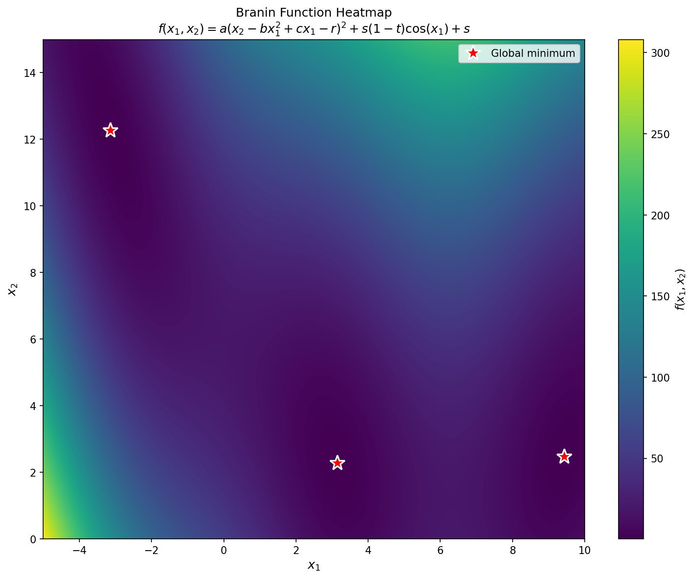
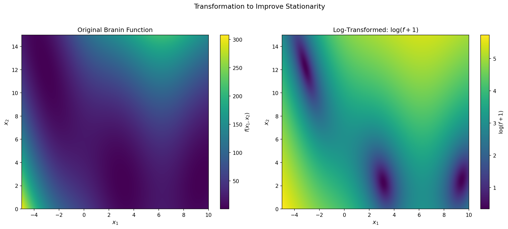
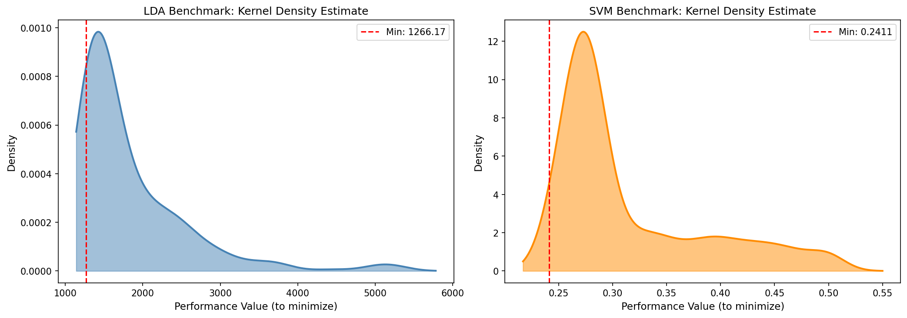
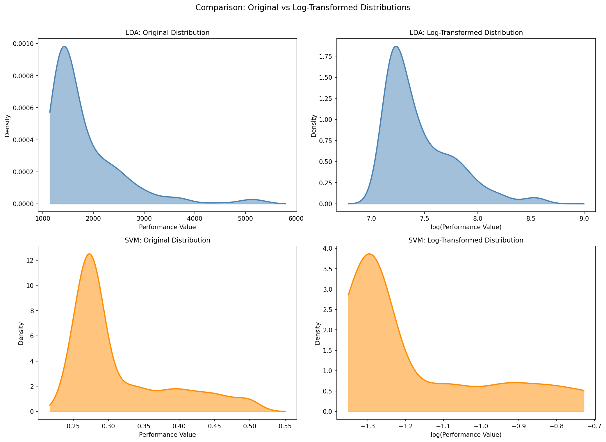

# Data Visualization

This section presents our initial exploration of the objective functions used in this Bayesian optimization investigation: the synthetic Branin benchmark and the real-world hyperparameter tuning datasets for SVM and LDA models.

---

## Bullet Point Reference

This report addresses each bullet point from the [instructions](instructions.md):

| Bullet | Instruction Summary | Report Section |
|--------|---------------------|----------------|
| 1 | Make a 1000×1000 heatmap of Branin function | [Section 1](#1-branin-function-heatmap) |
| 2 | Describe behavior and stationarity | [Section 2](#2-stationarity-analysis) |
| 3 | Find transformation for stationarity | [Section 3](#3-transformation-for-improved-stationarity) |
| 4 | KDE of LDA and SVM distributions, interpret | [Section 4](#4-kernel-density-estimates-for-lda-and-svm-benchmarks) |
| 5 | Find transformation for better-behaved distributions | [Section 5](#5-transformation-for-better-behaved-distributions) |

---

## 1. Branin Function Heatmap

> **Bullet 1:** *"Make a heatmap of the value of the Branin function over the domain X = [−5, 10] × [0, 15] using a dense grid of values, with 1000 values per dimension, forming a 1000 × 1000 image."*

We evaluated the Branin function over the domain $\mathcal{X} = [-5, 10] \times [0, 15]$ using a dense 1000 × 1000 grid (1,000,000 evaluation points).

**Figure 1:** Heatmap of the Branin function. Red stars mark the three global minima at $(-\pi, 12.275)$, $(\pi, 2.275)$, and $(9.42478, 2.475)$, each with value $f^* \approx 0.398$.

The Branin function is defined as:

$$f(x_1, x_2) = a\left(x_2 - bx_1^2 + cx_1 - r\right)^2 + s(1-t)\cos(x_1) + s$$

with standard parameters $a=1$, $b=\frac{5.1}{4\pi^2}$, $c=\frac{5}{\pi}$, $r=6$, $s=10$, $t=\frac{1}{8\pi}$.

**Key observations:**
- Function values range from approximately 0.4 (at minima) to over 300 (at corners)
- Three distinct global minima create multiple attraction basins
- The parabolic valley structure is modulated by the cosine term

---

## 2. Stationarity Analysis

> **Bullet 2:** *"Describe the behavior of the function. Does it appear stationary? (That is, does the behavior of the function appear to be relatively constant throughout the domain?)"*

**Does it appear stationary?** No. **The Branin function is non-stationary.** This is evident from several observations:

1. **Varying Magnitude:** The function values span a dramatic range from 0.4 to 308, indicating non-constant behavior across the domain.

2. **Asymmetric Structure:** The three global minima are not uniformly distributed—two lie near $x_2 \approx 2.5$ while one is at $x_2 \approx 12.3$, creating an asymmetric landscape.

3. **Quadratic Component:** The term $a(x_2 - bx_1^2 + cx_1 - r)^2$ creates a parabolic valley whose curvature varies with position.

4. **Periodic Modulation:** The cosine term $s(1-t)\cos(x_1)$ adds oscillation in the $x_1$ direction only, creating wave-like patterns that interact with the quadratic structure.

5. **Edge Effects:** Function values are significantly higher near domain boundaries, especially at the corners.

**Implications for Bayesian Optimization:**
- A stationary GP prior may struggle to model this varying behavior
- The optimizer may require more samples in high-variance regions
- Non-stationary or adaptive kernels may improve surrogate model quality

---

## 3. Transformation for Improved Stationarity

> **Bullet 3:** *"Can you find a transformation of the data that makes it more stationary?"*

**Yes.** We apply a log transformation to compress the dynamic range and improve stationarity:

$$g(x_1, x_2) = \log(f(x_1, x_2) + 1)$$

**Figure 2:** Comparison of original (left) and log-transformed (right) Branin function.

| Metric | Original | Log-Transformed |
|--------|----------|-----------------|
| Range | [0.40, 308.13] | [0.34, 5.73] |
| Max/Min Ratio | ~750× | ~17× |
| Std. Deviation | 51.35 | 1.12 |

**Why does this help stationarity?**
- Compresses the dynamic range by a factor of ~44×
- Reduces extreme values at domain boundaries
- Preserves the locations of minima and overall structure
- Provides approximate variance stabilization
- Makes the function appear more uniform across the domain

---

## 4. Kernel Density Estimates for LDA and SVM Benchmarks

> **Bullet 4:** *"Make a kernel density estimate of the distribution of the values for the LDA and SVM benchmarks. Interpret the distributions."*

We analyze the distribution of objective values for the hyperparameter tuning benchmarks:
- **LDA:** 288 hyperparameter configurations
- **SVM:** 1,400 hyperparameter configurations

**Figure 3:** Kernel density estimates of the objective value distributions. Dashed red lines indicate the minimum (best) performance.

### LDA Benchmark
| Statistic | Value |
|-----------|-------|
| Samples | 288 |
| Range | [1266.17, 5258.11] |
| Mean | 1820.67 |
| Std. Dev. | 722.33 |
| Skewness | 2.37 (right-skewed) |

**Interpretation:** The LDA objective exhibits a right-skewed distribution with a long tail toward poor performance. Most configurations cluster around moderate values (1300–2000), while some produce very poor results (>3000). Optimal configurations are relatively rare.

### SVM Benchmark
| Statistic | Value |
|-----------|-------|
| Samples | 1,400 |
| Range | [0.2411, 0.5000] |
| Mean | 0.3136 |
| Std. Dev. | 0.0693 |
| Skewness | 1.30 (right-skewed) |

**Interpretation:** The SVM error rate clusters around 0.27–0.35, with outliers at 0.5 (random chance). The pronounced mode suggests many configurations achieve similar moderate performance. The minimum (~0.24) represents near-optimal classification accuracy.

**Common Pattern:** Both distributions are right-skewed, reflecting a common property of hyperparameter landscapes—there are many ways to configure a model poorly but relatively few optimal configurations.

---

## 5. Transformation for Better-Behaved Distributions

> **Bullet 5:** *"Again, can you find a transformation that makes the performance better behaved?"*

**Yes.** We apply a log transformation to both benchmark distributions to improve their statistical properties:

$$y' = \log(y)$$

**Figure 4:** Comparison of original (left) and log-transformed (right) distributions for both benchmarks.

### Skewness Reduction

| Benchmark | Original Skewness | Log-Transformed | Reduction |
|-----------|-------------------|-----------------|-----------|
| LDA | 2.368 | 1.353 | **42.9%** |
| SVM | 1.302 | 1.078 | **17.2%** |

**Why does log transformation make distributions "better behaved"?**

1. **Improved Symmetry:** Both distributions become more symmetric (closer to Gaussian), which is beneficial for GP likelihood assumptions.

2. **Variance Stabilization:** The variance becomes more uniform across the range of values.

3. **Outlier Compression:** Extreme high values are compressed, reducing their influence on the GP fit.

4. **Normal Approximation:** Log-transformed data better approximates a Gaussian distribution.

**Recommendation:** Use log-transformed objective values when fitting Gaussian processes for Bayesian optimization on these benchmarks.

---

## Summary

| Bullet | Question | Answer |
|--------|----------|--------|
| 1 | Heatmap created? | Yes - 1000×1000 grid with 3 marked global minima |
| 2 | Is Branin stationary? | **No** - varies from 0.4 to 308, asymmetric structure |
| 3 | Transformation for stationarity? | **log(f+1)** reduces dynamic range 44× |
| 4 | KDE interpretation? | Both LDA and SVM are **right-skewed** |
| 5 | Transformation for better behavior? | **log(y)** reduces skewness by 17–43% |
