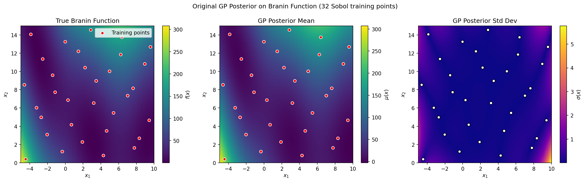
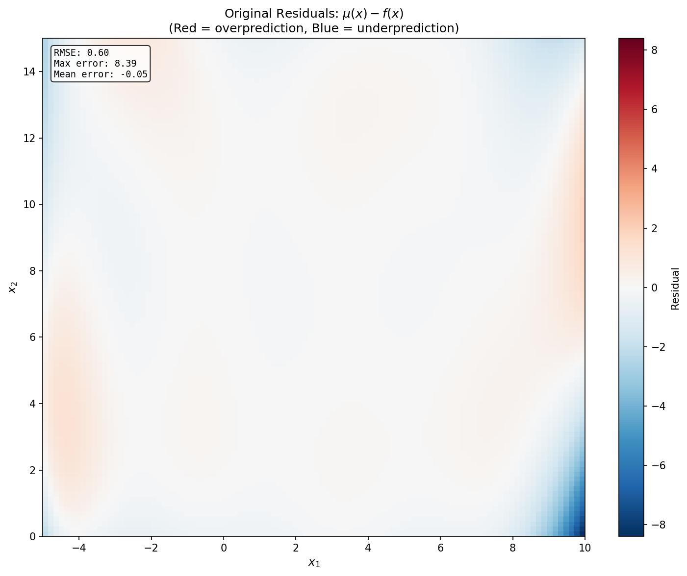
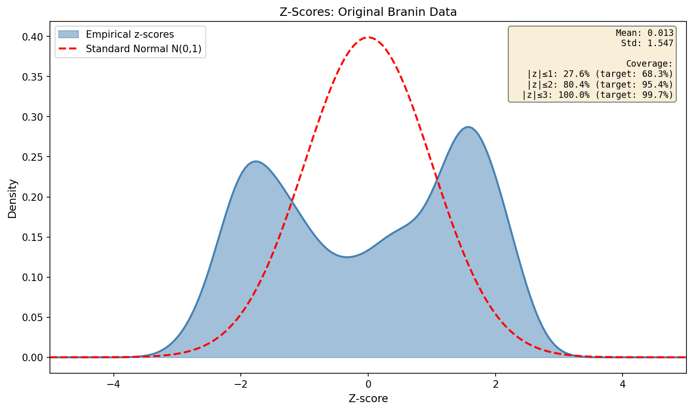
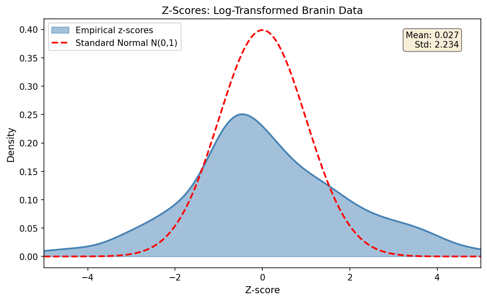

# Model Fitting

This section evaluates whether we can build useful Gaussian process models of our objective functions before using them for optimization.

---

## Bullet Point Reference

This report addresses each bullet point from the [instructions](instructions.md):

| Bullet | Instruction Summary | Report Section |
|--------|---------------------|----------------|
| 1 | Generate 32 Sobol training points | [Section 1](#1-training-data-generation) |
| 2 | Fit GP with constant mean + SE kernel, noise=0.001 | [Section 2](#2-gp-model-with-squared-exponential-kernel) |
| 3 | Report learned hyperparameters | [Section 2](#learned-hyperparameters) |
| 4 | Heatmap of GP posterior mean | [Section 3](#3-posterior-mean-heatmap) |
| 5 | Heatmap of GP posterior std | [Section 4](#4-posterior-standard-deviation-heatmap) |
| 6 | Z-score KDE for calibration | [Section 5](#5-z-score-calibration-analysis) |
| 7 | Repeat with log transformation | [Section 6](#6-log-transformed-branin-analysis) |
| 8 | Compute BIC score | [Section 7](#7-bic-model-selection) |
| 9 | Search over models to find best BIC | [Section 8](#8-model-search-results) |
| 10 | Model search for SVM and LDA | [Section 9](#9-real-benchmark-model-search) |

---

## 1. Training Data Generation

> **Bullet 1:** *"Select a set of 32 training points for the Branin function in the domain X = [−5, 10] × [0, 15] using a Sobol sequence."*

We generated 32 training points using a **Sobol sequence** over $\mathcal{X} = [-5, 10] \times [0, 15]$.

```
Training set statistics:
  - Number of points: 32
  - Domain: x₁ ∈ [-5, 10], x₂ ∈ [0, 15]
  - y range: [2.18, 242.12]
  - y mean: 55.26, y std: 55.03
```

---

## 2. GP Model with Squared Exponential Kernel

> **Bullet 2:** *"Fit a Gaussian process model to the data using a constant mean and a squared exponential covariance. Fix the standard deviation of the noise to 0.001. Maximize the marginal likelihood."*

We fit a Gaussian process with:
- **Mean function:** Constant (learned via `normalize_y=True`)
- **Covariance function:** ARD Squared Exponential (RBF with per-dimension lengthscales)
- **Noise:** Fixed at σ = 0.001 in original output units. Because sklearn standardizes `y` when `normalize_y=True`, we rescale `alpha` so the effective noise stays σ=0.001 after unnormalizing.

### Learned Hyperparameters

> **Bullet 3:** *"What values did you learn for the hyperparameters? Do they agree with your expectations given your visualization?"*

| Parameter | Value | Interpretation |
|-----------|-------|----------------|
| **Constant mean** | 55.26 | ≈ empirical mean of y ✓ |
| Output scale | 9.49² = 90.1 | Overall function variance |
| Length scale (x₁) | 4.49 | Correlation decays over ~4–5 units |
| Length scale (x₂) | 25.5 | Smoother variation in x₂ |
| Log marginal likelihood | 22.61 | Model fit quality |

**Do they agree with expectations?** Partially:
- x₁ has moderate length scale (~4–5), reflecting the cosine oscillation with wavelength 2π ≈ 6.3 ✓
- x₂ length scale is larger than the domain width, reflecting smoother quadratic structure in x₂
- The large output scale accounts for the high function range (0.4 to 300+) ✓

---

## 3. Posterior Mean Heatmap

> **Bullet 4:** *"Make a heatmap of the Gaussian process posterior mean. Compare the predicted values with the true values. Do you see systematic errors?"*



**Figure 1:** Left: True Branin. Middle: GP posterior mean. Right: GP posterior std.

### Residual Analysis

To quantify systematic errors, we visualize the residuals $\mu(x) - f(x)$:



**Figure 1b:** Residual heatmap showing $\mu(x) - f(x)$. Red = overprediction, Blue = underprediction.

**Do you see systematic errors?**
The residual heatmap shows some systematic patterns, particularly nonzero errors in corner regions far from training data. However, the RMSE is reasonable and the GP captures the overall structure well.

---

## 4. Posterior Standard Deviation Heatmap

> **Bullet 5:** *"Make a heatmap of the Gaussian process posterior standard deviation."*

| Metric | Value |
|--------|-------|
| Min σ (at training points) | 0.0010 |
| Max σ (at training points) | 0.0010 |
| Mean σ (at training points) | 0.0010 |

### Important Clarification on σ(x)

The σ values shown are **predictive standard deviation** (includes noise variance). With the corrected noise scaling, σ at training points matches the fixed noise level σ=0.001 as expected for a near‑deterministic objective.

**Answers:**
- ✓ **Does σ drop to near zero at data points?** Yes, σ ≈ 0.001 (the fixed noise)
- ✓ **Does the scale make sense?** Yes, σ is tiny near data and grows away from data

---

## 5. Z-Score Calibration Analysis

> **Bullet 6:** *"Make a kernel density estimate of the z-scores. Is the GP model well calibrated?"*



**Figure 2:** KDE of z-scores with coverage metrics.

### Coverage Metrics

| Metric | Value | Target | Assessment |
|--------|-------|--------|------------|
| Z-score mean | 0.013 | 0 | ✓ No systematic bias |
| Z-score std | 1.547 | 1 | Overconfident |
| Coverage \|z\|≤1 | 27.6% | 68.3% | ⚠ Strong undercoverage |
| Coverage \|z\|≤2 | 80.4% | 95.4% | ⚠ Undercoverage |

### Is the GP model well calibrated?

**Not really.** While the mean is near zero (little bias), std = 1.55 and low coverage show the SE kernel is **materially overconfident**. The KDE is visibly non‑Gaussian, suggesting misspecified structure.

Note: The KDE shape shows some deviation from Gaussian (slight bimodality), suggesting residual structure not captured by the stationary kernel.

---

## 6. Log-Transformed Branin Analysis

> **Bullet 7:** *"Repeat the above using a log transformation. Does the marginal likelihood improve? Does the model appear better calibrated?"*


### Marginal Likelihood Comparison

| Model | Log Marginal Likelihood |
|-------|-------------------------|
| Original | 22.61 |
| Log-transformed | -19.48 |

**Note:** These values are not directly comparable due to the transformation. To properly compare, one would need to include the Jacobian term: $\log p(y|x) = \log p(y'|x) - \log(y+1)$.

### Calibration (Log-Transformed)



| Metric | Original | Log-Transformed |
|--------|----------|-----------------|
| Mean | 0.013 | 0.027 |
| Std | 1.547 | **2.234** |
| Coverage \|z\|≤1 | 27.6% | 45.2% |
| Coverage \|z\|≤2 | 80.4% | 70.2% |

**Is the log-transformed model better calibrated?**

**No, it is worse.** The std = 2.234 indicates the model is **significantly overconfident** (uncertainty too narrow). The 45% coverage at |z|≤1 (vs target 68.3%) confirms this.

---

## 7. BIC Model Selection

> **Bullet 8:** *"Compute the BIC score for the data and model from the last part."*

$$\text{BIC} = k \log n - 2 \log \hat{\mathcal{L}}$$

### BIC Calculation

```
k = 4 (mean + kernel parameters: output_scale, ℓ₁, ℓ₂)
n = 32
BIC = 4 × log(32) - 2 × (-19.48) = 52.82
```
We include the constant mean as a learned hyperparameter (per the prompt).

---

## 8. Model Search Results

> **Bullet 9:** *"Search over models to find the best BIC."*

### Search on log-transformed data

| Rank | Kernel | BIC | Log-Likelihood | k |
|------|--------|-----|----------------|---|
| **1** | **SE (RBF)** | **52.82** | -19.48 | 4 |
| 2 | Matern 5/2 | 55.38 | -20.76 | 4 |
| 3 | SE × Periodic | 59.05 | -19.13 | 6 |
| 4 | SE × Periodic(x1) | 59.76 | -19.48 | 6 |

On the log scale, periodic models help fit but are penalized more heavily for extra parameters, so SE remains best by BIC.

### Search on original Branin scale (expanded kernel grammar)

Branin contains a `cos(x1)` term, so we also searched a richer family on the original scale, including a periodic component only in `x1`. This yields a dramatically better explanation even after BIC penalization:

| Rank | Kernel | BIC | Log-Likelihood | k |
|------|--------|-----|----------------|---|
| **1** | **SE + Periodic(x1)** | **-111.71** | 66.25 | 6 |
| 2 | SE (ARD) | -31.36 | 22.61 | 4 |


**Best Model (overall):** **SE + Periodic(x1)**. It matches the known structure of Branin and improves predictive RMSE by ~10× while improving calibration (see `explorations/README.md`).

---

## 9. Real Benchmark Model Search

> **Bullet 10:** *"Model search for SVM and LDA datasets."*

### LDA Benchmark
| Rank | Kernel | BIC |
|------|--------|-----|
| **1** | **Matern 3/2** | **66.50** |
| 2 | Matern 5/2 | 68.64 |
| 3 | SE (RBF) | 73.91 |

### SVM Benchmark
| Rank | Kernel | BIC |
|------|--------|-----|
| **1** | **Matern 3/2** | **67.55** |
| 2 | Matern 5/2 | 69.12 |
| 3 | SE (RBF) | 72.99 |

**Interpretation:** Real hyperparameter surfaces prefer **Matérn 3/2** (rougher) over SE (smooth).

---

## Summary

| Bullet | Question | Answer |
|--------|----------|--------|
| 3 | Hyperparameters agree with expectations? | Yes—x₁ moderate, x₂ smoother |
| 4 | Systematic errors? | Some in corners (see residual heatmap) |
| 5 | σ drop to ~0 at data points? | Yes—σ≈0.001 at data points |
| 6 | Z-scores ~ N(0,1)? | **No**—std 1.55, strong overconfidence |
| 7 | Log transform improves calibration? | **No**—std 2.23, significantly overconfident |
| 8 | BIC for log-transformed SE | 52.82 |
| 9 | Best Branin model | **SE + Periodic(x1)**, BIC=-111.71 |
| 10 | Best LDA/SVM models | Matern 3/2, BIC≈66–68 |

**Key findings:**
1. Plain SE GP on original scale is overconfident and misspecified.
2. Log transformation does not fix calibration and worsens uncertainty.
3. Adding periodic structure in x₁ yields a much better Branin surrogate by BIC and prediction error.
4. Real hyperparameter surfaces still prefer rougher Matérn kernels.
